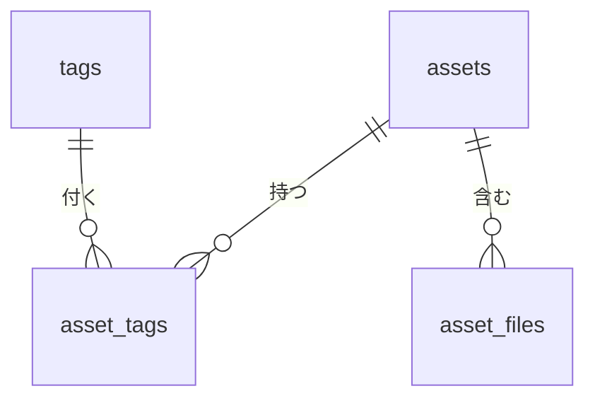

# 00. 全体設計と進捗

Megascans Browser の設計を、別のプロジェクトでも同じ形で作れるようにまとめたもの。
細かい説明は各ノート（01〜10）にある。ここでは「何を、どういう理由で、どの順に作ったか」を一通り追えるようにする。

## 1. 何を作っているか

ダウンロード済みの Megascans アセット（`Megascans_Library/Downloaded`）を、種類・カテゴリ・タグ・色・業界で検索して表示するデスクトップアプリ。

```
Megascans フォルダ（JSON + 画像 + メッシュ）
        │  Step 4: スキャナーが索引（assetsData.json）を読む
        ▼
AssetLibrary（library.py）      ← Step 3: 登録・取得・検索・更新・削除の API。SQL はここだけ
        │
db.py（connect / init_db）      ← Step 2: 接続とスキーマ
        │
SQLite（.db ファイル1つ）
        ▲
        │  Step 5: UI が AssetLibrary の検索を呼んで表示する
PySide6 の画面
```

**層を分ける理由**：上の層は下の層のメソッドだけを使い、中身を知らない。テーブル構成を変えても直すのは `library.py` だけで、スキャナーや UI には影響しない。

## 2. 進捗

| Step | 内容 | 状態 | 成果物 |
|---|---|---|---|
| 1 | Python 開発の土台 | ✅ | `pyproject.toml`、`src/` レイアウト、uv |
| 2 | DB スキーマ設計 | ✅ | `db.py`、`tests/test_db.py` |
| 3 | AssetLibrary API | ✅ | `library.py`、`tests/test_library.py` |
| 4 | スキャナー（索引 → DB） | ✅ | `scanner.py`、`tests/test_scanner.py` |
| 5 | UI（PySide6） | 設計済み | [11_UI設計.md](11_UI設計.md) |

テスト 76 件がすべて成功、ruff の指摘 0 件（2026-10-02 時点）。実データ 8,303 件のスキャンは約12秒。

## 3. プロジェクト構成

```
MegascansBrowser/
├─ pyproject.toml            依存・ツール設定（uv, pytest, ruff）
├─ uv.lock                   依存の正確なバージョン（自動生成）
├─ src/megascans_browser/
│   ├─ __init__.py           エントリポイント（main）
│   ├─ db.py                 接続とスキーマ
│   ├─ library.py            AssetLibrary
│   └─ scanner.py            assetsData.json → DB
├─ tests/
│   ├─ test_db.py            スキーマのテスト（SQL を直接書く）
│   ├─ test_library.py       API のテスト
│   └─ test_scanner.py       スキャナーのテスト
├─ docs/                     参考資料（Houdini ワークショップ）
└─ _learning/                学習ノート
```

- `src/` レイアウト：パッケージを `src/` の下に置くと、インストールしたものだけが import される。カレントディレクトリのファイルを誤って import する事故を防げる（[01](01_uvとpyproject.md)）。

## 4. 開発環境の再現

```
uv init --package megascans_browser    # src レイアウトのパッケージを作る
uv add pyside6                         # 実行時の依存
uv add --dev pytest ruff               # 開発用の依存
```

`pyproject.toml` に追加した設定：

```toml
[tool.ruff]
line-length = 100
extend-exclude = ["docs", "_learning"]      # Markdown 内のコード例は対象外

[tool.ruff.lint]
select = ["E", "W", "F", "I", "B", "UP"]
```

`.gitignore` には `*.db` を入れる（DB はスキャンでいつでも作り直せる生成物）。

日々のコマンド：

```
uv run pytest            # テスト
uv run ruff check        # リント
uv run ruff format       # 整形
```

## 5. 元データを先に調べる

設計の前に実データ（JSON 4件）を確認し、そこから設計を決めた（[05](05_DBスキーマ設計.md)、[08](08_MegascansのJSON構造.md)）。

| 観察 | 設計への反映 |
|---|---|
| `categories` は階層（`["surface", "concrete", "rough"]`） | `surface/concrete/rough` のパス文字列で保存し、前方一致で配下を探す |
| `tags` の数は1〜18個とバラバラ | 別テーブル＋中間テーブル（多対多） |
| `semanticTags.color` / `industry` も検索に使いたい | `tags` テーブルに `kind` 列を足して同居させる |
| `meta` や `semanticTags` の中身は種類ごとに違う | 列にせず `metadata`（JSON 列）にまとめる |
| JSON のファイル一覧は「ダウンロード可能なもの全部」で、手元のファイルと一致しない | 手元のファイル一覧はフォルダを走査して作る |

**教訓**：取得する項目は最初に全部固めなくてよい。DB は元データのコピーなので、作り直せる。先に決めるべきなのは「構造」（何で識別するか、テーブル同士の関係）。

## 6. DB 設計

### テーブル



| テーブル | 1行の意味 | 主な列 |
|---|---|---|
| `assets` | アセット1件 | `megascans_id`（UNIQUE）、`name`、`asset_type`、`category`、`folder_path`、`preview_path`、`metadata`（JSON） |
| `tags` | タグ1つ（全アセットで共有） | `kind`（tag / color / industry）、`name`、`UNIQUE (kind, name)` |
| `asset_tags` | 「アセット X にタグ Y が付いている」 | 主キー `(asset_id, tag_id)` |
| `asset_files` | アセット内のファイル1つ | `kind`（texture / mesh）、`map_type`、`lod`、`resolution`、`rel_path` |

### 設計の判断

| 判断 | 理由 |
|---|---|
| 内部 id（サロゲートキー）と `megascans_id`（ナチュラルキー）を分ける | 結合には小さく変わらない id を使い、外部の ID は UNIQUE 制約で重複を防ぐ |
| 多対多は中間テーブル | 1つのマスに値は1つ。片方に外部キーを持たせるだけでは1対多しか表せない |
| 中間テーブルに逆順インデックス `(tag_id, asset_id)` | 主キーは「アセット → タグ」にしか効かない。「タグ → アセット」の検索用 |
| タグの種類は `kind` 列で分ける | テーブルを増やさずに、`asset_tags` と検索 SQL を共通で使える |
| `asset_type` は `category` の先頭と重複するが列にする | UI で一番よく使う絞り込みなので、インデックスを張る（意図的な非正規化） |
| よく検索するもの → 列 / テーブル、たまに見るもの → JSON 列 | 全部を列にすると NULL だらけになる |

### DB に守らせるルール（制約）

| 制約 | 例 | 防ぐもの |
|---|---|---|
| `STRICT` | 全テーブル | 列の型と違う値（`'LOD0'` を INTEGER 列に入れる、など） |
| `CHECK` | `kind IN ('texture', 'mesh')`、`json_valid(metadata)` | 想定外の値、壊れた JSON |
| `COLLATE NOCASE` | `tags.name` | `Gray` と `gray` の重複 |
| 外部キー＋`ON DELETE CASCADE` | `asset_tags`、`asset_files` | 存在しない親の参照、親を消したあとの残骸 |

アプリのコードにバグがあっても、DB が不正なデータを拒否してくれる。

### db.py の役割

| 関数 | 役割 |
|---|---|
| `connect(db_path)` | 接続を開き、`row_factory = sqlite3.Row`（列名で読める）と `PRAGMA foreign_keys = ON`（SQLite は外部キーがデフォルトで無効）を設定する |
| `init_db(conn)` | スキーマを作る。`BEGIN` 〜 `COMMIT` で囲み、全部作るか何も作らないかにする |
| `get_schema_version(conn)` | `PRAGMA user_version` を読む |

**スキーマのバージョン管理**：DB ファイルのヘッダーにある `user_version`（新しい DB は 0）に、作成したスキーマのバージョンを書いておく。

- 0 → 新しい DB なのでテーブルを作る
- `SCHEMA_VERSION` と同じ → 作成済みなので何もしない
- それ以外 → 想定外なのでエラー（将来ここにマイグレーションを書く）

## 7. AssetLibrary（API 層）

docs の `AssetLibrary` を参考に、Megascans 用に作り直した。

### メソッド

| メソッド | 役割 | 戻り値 |
|---|---|---|
| `AssetLibrary(db_path)` | 接続して `init_db` する。`with` で使える | — |
| `create_asset(id, name, category, folder_path, *, ..., exist_ok=False)` | アセット＋タグ＋ファイルを登録 | `AssetRecord` |
| `get_asset(id)` | 1件取得 | `AssetRecord \| None` |
| `find_assets(*, name, asset_type, category, tags, colors, industries)` | 絞り込み検索（AND）。条件なしなら全件 | `list[AssetRecord]` |
| `list_categories()` / `list_tags(kind)` | UI の絞り込みメニュー用の選択肢 | `list[str]` |
| `update_asset(id, *, ...)` | 指定した項目だけ更新 | `AssetRecord` |
| `delete_asset(id)` | DB から削除（ファイルは消さない） | `bool` |

例外：`AssetAlreadyExistsError`（二重登録）、`AssetNotFoundError`（存在しないものを更新）、`ValueError`（`list_tags` の kind が不正）。

### docs との違い

| | docs | このプロジェクト |
|---|---|---|
| 識別 | カテゴリ＋名前 | `megascans_id` |
| フォルダ | 登録時に作る / 削除時に消せる | 作らない・消さない（Megascans が管理するユーザーのファイル） |
| 検索 | 名前かカテゴリのどちらか1つ | 複数条件を AND で組み合わせる |

### 実装パターン（他でもそのまま使える）

**① 戻り値は frozen dataclass**

```python
@dataclass(frozen=True)
class AssetRecord:
    megascans_id: str
    tags: tuple[str, ...]
    ...
```

`sqlite3.Row` をそのまま返さず専用の型にする。呼び出す側が列名に依存せず、補完も効く。読み出した時点の写しなので、変更できないようにする。

**② 複数テーブルへの書き込みはトランザクションで囲む**

```python
with self._conn:      # 成功 → COMMIT、例外 → ROLLBACK
    INSERT INTO assets ...
    INSERT INTO asset_tags ...
    INSERT INTO asset_files ...
```

途中で失敗しても中途半端なデータが残らない。`with conn:` は接続を閉じない点に注意。

**③ 共有されるマスタ行は「なければ作って id を引く」**

```python
INSERT INTO tags (kind, name) VALUES (?, ?) ON CONFLICT DO NOTHING
SELECT id FROM tags WHERE kind = ? AND name = ?
INSERT INTO asset_tags (asset_id, tag_id) VALUES (?, ?) ON CONFLICT DO NOTHING
```

**④ 検索 SQL は条件の分だけ組み立てる**

```python
conditions, params = [], []
if asset_type:
    conditions.append("a.asset_type = ?")
    params.append(asset_type)
sql = "SELECT a.id FROM assets AS a"
if conditions:
    sql += " WHERE " + " AND ".join(conditions)
```

SQL の形は文字列で組み立てるが、値は必ず `?` で渡す（SQL インジェクション対策）。

**⑤ 「全部持つ」検索は GROUP BY + HAVING**

```sql
a.id IN (
    SELECT at.asset_id FROM asset_tags AS at JOIN tags AS t ON t.id = at.tag_id
    WHERE t.kind = ? AND t.name IN (?, ?)
    GROUP BY at.asset_id
    HAVING COUNT(*) = 2        -- 指定した個数と一致 = 全部持っている
)
```

入力の重複（`gray` と `GRAY`）は事前に消しておかないと、個数がずれて何も見つからなくなる。

**⑥ LIKE の入力はエスケープする**

`%` と `_` を `\%` `\_` に置き換えて `ESCAPE '\'` を付ける。しないと `%` の入力で全件一致する。

**⑦ 「指定なし」と「None」を番兵で区別する**

```python
UNSET = _Unset()
def update_asset(self, id, *, preview_path: str | None | _Unset = UNSET): ...
```

省略 → 変更しない、`None` → 値を消す、値 → その値にする。

**⑧ 子テーブルの更新は「消して入れ直す」**

差分を計算するより単純で間違えにくい。

**⑨ 再スキャン用の上書き（`exist_ok=True`）は全項目を置き換える**

元データ（JSON）が正しいので、省略された項目も空で上書きして JSON とそろえる。部分更新の `update_asset()` とは意味が違う。

## 8. テストの方針

| 方針 | やり方 |
|---|---|
| テストごとに新しい DB | fixture で `":memory:"` の DB を作る。テスト同士が影響しない |
| 実データに近いサンプル | 実際の JSON 4件の値（名前・カテゴリ・タグ・色・業界）を使う |
| 層ごとにテストを分ける | `test_db.py` はスキーマ（制約・インデックス・SQL）を、`test_library.py` は API の振る舞いを確かめる |
| 成功だけでなく失敗も確かめる | 制約違反のエラー、失敗時に何も残らないこと（ロールバック）、存在しない ID |
| インデックスが効いているか | `EXPLAIN QUERY PLAN` の結果にインデックス名が出るか |

## 9. 別のプロジェクトで再現する手順

素材ライブラリ、画像管理、ドキュメント検索など「ファイル群＋メタデータを検索したい」ものなら、同じ形で作れる。

1. **元データを数件じっくり見る**：どの項目が全件にあるか、複数の値を持つか、種類ごとに形が違うか。
2. **識別子を決める**：外部の ID（ナチュラルキー）を UNIQUE にし、結合用に内部 id を持つ。
3. **テーブルに分ける**：
   - 1件に1つの値 → 本体テーブルの列
   - 1件に複数の値で検索したい → マスタ＋中間テーブル（種類が複数なら `kind` 列）
   - 1件に複数の子要素 → 子テーブル（親の id を持つ）
   - 形がバラバラで検索しない → JSON 列
4. **制約を付ける**：`STRICT`、`NOT NULL`、`UNIQUE`、`CHECK`、外部キー＋`ON DELETE CASCADE`。
5. **よく使う絞り込みにインデックス**：`EXPLAIN QUERY PLAN` で確かめる。
6. **`db.py` を作る**：`connect`（`row_factory` と `foreign_keys`）と `init_db`（`user_version` でバージョン管理）。
7. **API クラスを作る**：create / get / find / list / update / delete。SQL はここだけに書き、戻り値は dataclass。7章の①〜⑨のパターンを使う。
8. **テストを書く**：`:memory:` の fixture、実データに近いサンプル、失敗ケース。
9. **スキャナーと UI は API だけを呼ぶ**。

## 10. 今後と、今は許容していること

**Step 4（スキャナー）で決めたこと**

実行：`uv run megascans-browser scan Z:\Assets\Megascans\Downloaded --db megascans.db`

| 判断 | 理由 |
|---|---|
| 個別の `<id>.json` ではなく、Bridge の索引 `Downloaded/assetsData.json` を読む | ネットワークドライブでは個別 JSON は 8,303 件で約4分、索引は約1秒。必要な項目（id・名前・カテゴリ・タグ・色・業界・`path`・`preview`）は全部入っている。フォルダとの一致も確認済み |
| ファイル一覧（`asset_files`）は今回作らない | フォルダの走査は全件で約50分かかる。UI で必要になったときに個別に走査する |
| カテゴリは小文字にそろえる | `3d/nature/rock` と `3d/Nature/Rock` が混在（579種類 → 495種類） |
| タグの前後の空白・空の値・重複を除く | 索引に `" dark"` や `" "` が入っている |
| 索引から消えたアセットは DB から消す。読めない項目は消さずに残す | 索引と DB を同じにする。壊れた1件のせいで登録が消えないようにする |
| スキャン全体を `transaction()` で1つにまとめる | アセットごとの COMMIT で約33秒 → まとめて約12秒。途中で失敗しても前回の状態が残る |

`AssetLibrary.transaction()` は入れ子にでき、内側は SAVEPOINT になる。`create_asset()` などは内部で `transaction()` を使うので、外側で囲めば1回の COMMIT にまとまる。

**今は許容していること（必要になったら直す）**

| 内容 | 今の状態 | 直し方 |
|---|---|---|
| N+1 問題 | `find_assets()` は1件ごとにタグ・ファイルを読む | タグ・ファイルをまとめて読む |
| 使われなくなったタグ | `tags` に残る（`list_tags()` には出ない） | 削除時に掃除する |
| カテゴリの前方一致 | `LIKE` なのでインデックスが効かない | 範囲検索（`>=` と `<`）に変える |
| 色の表記揺れ | `gray` と `grey`、`brown. green` のような値が別の色として残る | 同義語の対応表で正規化する |
| タグの表示名 | 大文字小文字違い（`Green` と `green`）は最初に登録された表記になる | 表示時にそろえる |

## 詳細ノート

| 内容 | ノート |
|---|---|
| uv、pyproject、src レイアウト | [01](01_uvとpyproject.md)、[02](02_venvの中身.md)、[03](03_Scriptsのexeとランチャー.md) |
| DB スキーマ設計 | [05](05_DBスキーマ設計.md) |
| Python から SQL を使う仕組み | [07](07_PythonからSQLを使う仕組み.md) |
| Megascans の JSON | [08](08_MegascansのJSON構造.md) |
| pytest と ruff | [09](09_pytestとruff.md) |
| AssetLibrary | [10](10_AssetLibrary.md) |
| UI 設計 | [11](11_UI設計.md) |
| 依存の方向（レイヤー、アダプター、依存性のルール） | [12](_learning/12_依存の方向.md) |
